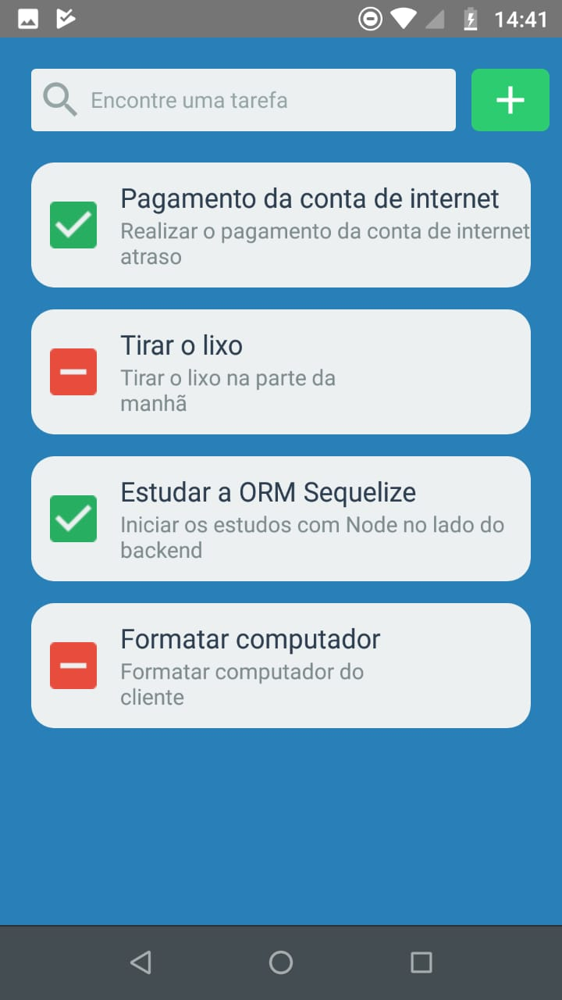
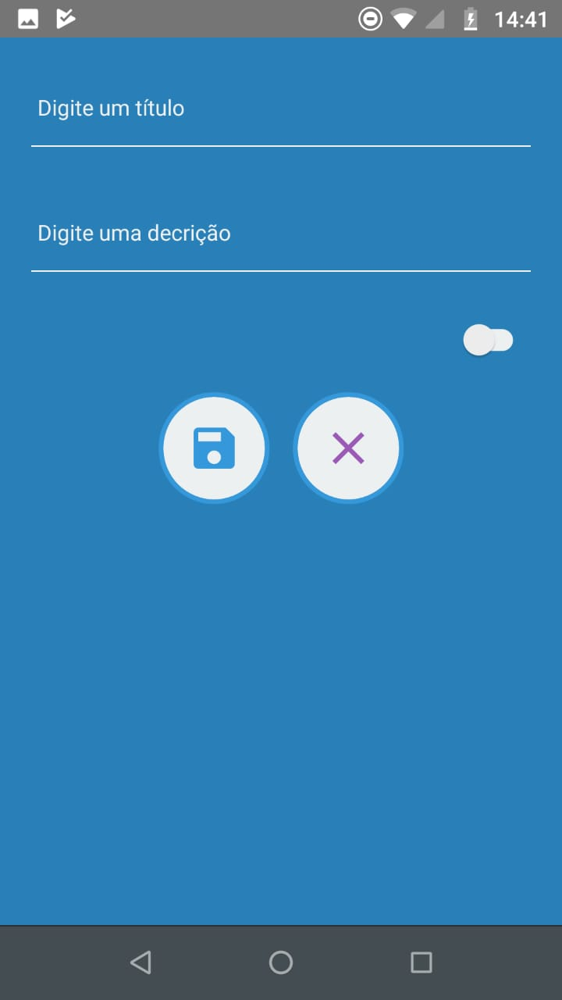
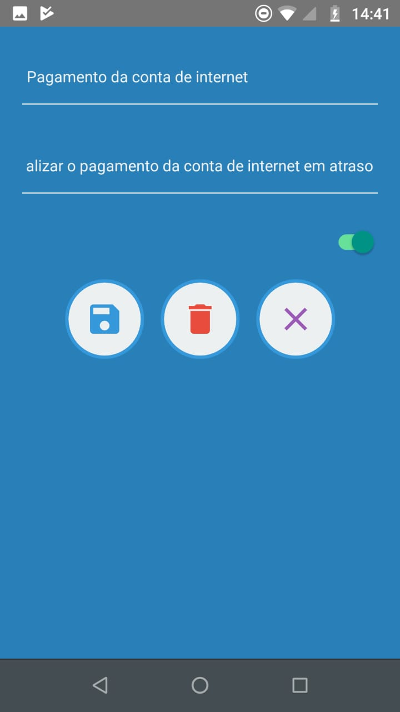

# App Tarefas

## Tecnologias

Projeto desenvolvido com as seguintes tecnologias:

- NodeJS
- React Native
- MongoDB

## Projeto
Projeto desenvolvido com o objetivo de registrar as tarefas que estão pendentes ou concluídas

## Configurando o backend

1. Dentro da pasta backend execute o comando `yarn install` para instalar as dependências.

2. Altere a porta configurada se necessário em src/server.js

2. Execute o comando `yarn dev` para subir o servidor backend

## Configurando o frontend - mobile
1. Dentro da pasta mobile execute o comando yarn install
2. Execute o comando react-native run-android para executar a aplicação

## Autor
William José Dias <a href="https://github.com/WilliamWJD">GIT</a>